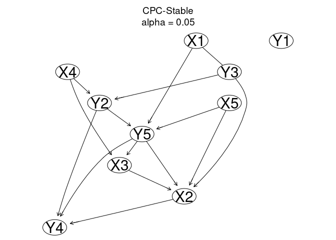
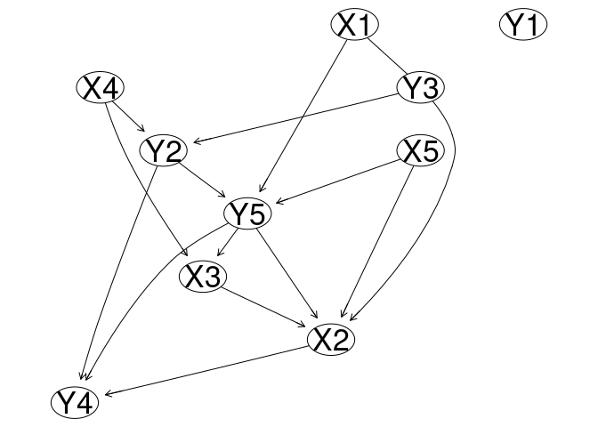
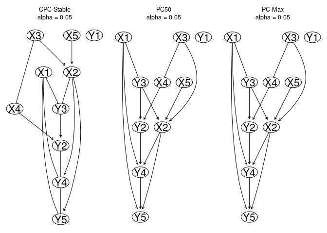
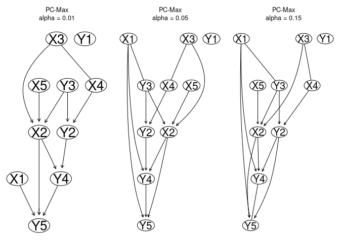
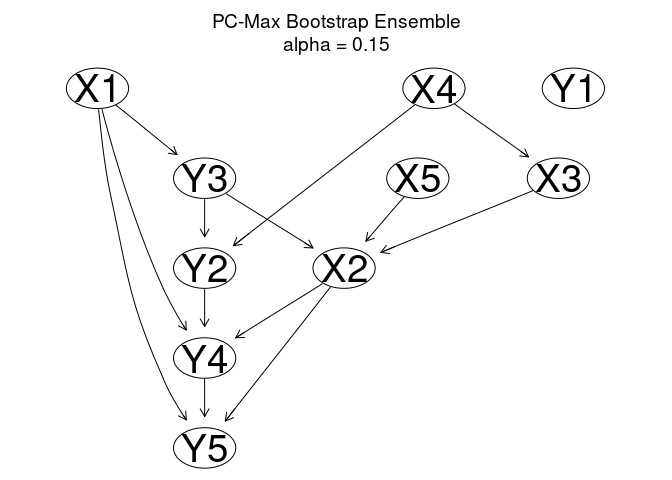
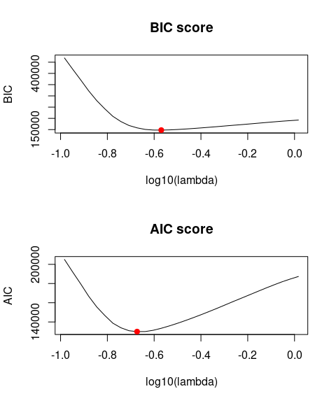

# rCausalMGM

## Requirements

For Windows and Linux users, the rCausalMGM package can be installed directly in R (>=4.0) following the instructions outlined below. MacOS users need to install a `gfortran` compiler in order to build the rCausalMGM package. `gfortran` compilers for a variety of Mac OS versions can be found [here](https://github.com/fxcoudert/gfortran-for-macOS/releases).

## Installing the rCausalMGM package

The rCausalMGM package can be installed directly from its GitHub
repository by executing the following code:

``` r
if (!require(devtools, quietly = TRUE))
    install.packages("devtools")

devtools::install_github("tyler-lovelace1/rCausalMGM")
```

    ## Downloading GitHub repo tyler-lovelace1/rCausalMGM@HEAD

    ## 
    ##      checking for file ‘/tmp/RtmpBAbXHn/remotes11f65356e88a01/tyler-lovelace1-rCausalMGM-4ca1549/DESCRIPTION’ ...  ✔  checking for file ‘/tmp/RtmpBAbXHn/remotes11f65356e88a01/tyler-lovelace1-rCausalMGM-4ca1549/DESCRIPTION’
    ##   ─  preparing ‘rCausalMGM’:
    ##    checking DESCRIPTION meta-information ...  ✔  checking DESCRIPTION meta-information
    ## ─  cleaning src
    ##   ─  checking for LF line-endings in source and make files and shell scripts
    ##   ─  checking for empty or unneeded directories
    ##   ─  looking to see if a ‘data/datalist’ file should be added
    ##        NB: this package now depends on R (>= 3.5.0)
    ##        WARNING: Added dependency on R >= 3.5.0 because serialized objects in
    ##      serialize/load version 3 cannot be read in older versions of R.
    ##      File(s) containing such objects:
    ##        ‘rCausalMGM/data/dag_n10000_p10.rda’
    ##        ‘rCausalMGM/data/dag_n250_p500.rda’
    ## ─  building ‘rCausalMGM_1.0.tar.gz’
    ##      
    ## 

    ## Installing package into '/home/tyler/R/x86_64-pc-linux-gnu-library/4.1'
    ## (as 'lib' is unspecified)

## Loading the rCausalMGM package and sample datasets

We begin by loading a toy synthetic dataset. This synthetic dataset,
`train_n10000_p10`, contains 10,000 samples from 10 features (5
continuous and 5 categorical). This dataset has a large enough sample
size for a small graph to enable perfect recovery of the Markov
equivalence class of the corresponding causal DAG, `dag_n10000_p10`.

``` r
library(rCausalMGM)

data(train_n10000_p10)
data(dag_n10000_p10)

print(head(train_n10000_p10))
```

    ##           X1          X2         X3         X4         X5 Y1 Y2 Y3 Y4 Y5
    ## 1 -0.1032843  1.51656848  1.6732801 -0.4708008  0.9999730  A  B  A  B  A
    ## 2  0.3748836 -0.38811637 -0.6579513 -0.7048476  1.3844457  A  B  A  B  A
    ## 3 -1.3737184  0.03107079  0.7662326  0.5035131 -0.5010449  A  A  B  B  A
    ## 4  2.3889562 -1.36889096 -1.1946817  2.0358353  0.9168064  A  A  B  C  B
    ## 5 -1.3785314 -0.13704609 -2.4455097  1.8642418  0.4437788  C  A  C  B  A
    ## 6  1.3540231 -0.65017245  0.2355710 -0.5957924  0.6637254  A  A  C  C  C

``` r
print(dag_n10000_p10)
```

    ## Algorithm:   
    ## Nodes:  10 
    ## Edges:  15 
    ##   Undirected:  0 
    ##   Directed:  15 
    ##   Bidirected:  0

## Recovering the Completed Partially Directed Acyclic Graph (CPDAG) with CPC-Stable

In the causally sufficient case and with asymptotically large sample
sizes, the PC algorithms can identify the Markov equivalence class of
the causal DAG. On this toy dataset, we can perfectly recover this
Markov equivalence class, also known as the CPDAG. Here, we run the
conservative PC-Stable (CPC-Stable) algorithm to learn the causal graph.
The conservative in CPC-Stable refers to the conservative rule for
orienting colliders, which requires all conditional independence tests
performed for a given unshielded triple to agree that it is a collider
for it to be oriented as such.

``` r
g <- cpcStable(train_n10000_p10, alpha = 0.05, verbose=T)
```

    ## Starting CPC-Stable algorithm...
    ##   Starting FAS Stable...
    ##     Searching at depth 0...    Searching at depth 1...    Searching at depth 2...    Searching at depth 3...    Searching at depth 4...    Searching at depth 5...
    ##   FAS Stable Elapsed time =  2.6 s
    ##   Orienting edges...
    ## CPC-Stable Elapsed time =  4.1 s

``` r
print(g)
```

    ## Algorithm:  CPC-Stable 
    ## Nodes:  10 
    ## Edges:  15 
    ##   Undirected:  1 
    ##   Directed:  14 
    ##   Bidirected:  0 
    ## alpha =  0.05

``` r
plot(g)
```

<!-- -->

### Structural Hamming Distance (SHD) as a measure of causal structure recovery

Since we know the ground truth for this synthetic dataset, we can
compare the learned graph `g` with its CPDAG. We do this using the
Structural Hamming Distance (SHD), which is a measure for the distance
between two graphs. For this package, we define the SHD as the sum of
two components: the SHD of the skeleton, and the SHD of the
orientations. The SHD of the skeleton measures the number of differences
in the adjacencies of two graphs (*i.e.* the number of adjacencies that
are in one graph but not another). The SHD of the orientations measures
the number of differently oriented endpoints for edges that appear in
both graphs. Each different endpoint adds 0.5 to the SHD, meaning that
the difference between A — B and A –\> B contributes 0.5 to the SHD,
while the difference between A \<– B and A –\> B contributes 1 to the
SHD. As this is a distance metric, lower is better, with an SHD of zero
indicating that the two graphs are identical.

``` r
cpdag_n10000_p10 <- createCPDAG(dag_n10000_p10)

print(cpdag_n10000_p10)
```

    ## Algorithm:   
    ## Nodes:  10 
    ## Edges:  15 
    ##   Undirected:  1 
    ##   Directed:  14 
    ##   Bidirected:  0

``` r
plot(cpdag_n10000_p10)
```

<!-- -->

``` r
print(paste0('SHD: ', SHD(cpdag_n10000_p10, g)))
```

    ## [1] "SHD: 0"

### Saving the learned graph as a `.sif` file for visualization in Cytoscape

For the purpose of visualization, we can save the learned graph as
`.sif` file using the following command.

``` r
saveGraph(g, 'cpc_graph.sif')
```

``` r
knitr::include_graphics(c('cpc_graph.png'))
```


**Figure 1:** The causal graph learned by CPC-Stable after being
visualized in Cytoscape. The blue nodes are continuous, while the purple
nodes are categorical.

## Learning causal graphs on finite sample sizes

In practice, most real datasets have much lower sample sizes. This leads
to less accurate recovery of the causal graph, and makes the selection
of the orientation rule and the significance threshold `alpha` more
important. For a given value of `alpha`, all PC algorithms will learn
the same skeleton, and will only differ in their orientations.

``` r
train_n300_p10 <- train_n10000_p10[1:300,]

par(mfrow=c(1,3))
g1 <- cpcStable(train_n300_p10, alpha=0.05, verbose = F)
plot(g1)
g2 <- pc50(train_n300_p10, alpha=0.05, verbose = F)
plot(g2)
g3 <- pcMax(train_n300_p10, alpha=0.05, verbose = F)
plot(g3)
```

<!-- -->

``` r
cpdag_n300_p10 <- createCPDAG(dag_n10000_p10)

graphList <- list(g1, g2, g3)

paste0('Skeleton SHD: ', 
       paste(sapply(graphList, function(x) x[['algorithm']]), 
             sapply(graphList, skeletonSHD, graph2=cpdag_n300_p10), 
             sep=': ', collapse = ', '))
```

    ## [1] "Skeleton SHD: CPC-Stable: 4, PC50: 4, PC-Max: 4"

``` r
paste0('Orientation SHD: ', 
       paste(sapply(graphList, function(x) x[['algorithm']]), 
             sapply(graphList, orientationSHD, graph2=cpdag_n300_p10), 
             sep=': ', collapse = ', '))
```

    ## [1] "Orientation SHD: CPC-Stable: 3.5, PC50: 2.5, PC-Max: 2.5"

``` r
paste0('Total SHD: ', 
       paste(sapply(graphList, function(x) x[['algorithm']]), 
             sapply(graphList, SHD, graph2=cpdag_n300_p10), 
             sep=': ', collapse = ', '))
```

    ## [1] "Total SHD: CPC-Stable: 7.5, PC50: 6.5, PC-Max: 6.5"

Different values of `alpha` will affect both the sparsity of the learned
graph, and the orientation of the edges. For example, we run the PC-Max
algorithm at `alpha = 0.01`, `alpha = 0.05`, and `alpha = 0.15`.

``` r
par(mfrow=c(1,3))

g1 <- pcMax(train_n300_p10, alpha=0.01, verbose = F)
plot(g1)
g2 <- pcMax(train_n300_p10, alpha=0.05, verbose = F)
plot(g2)
g3 <- pcMax(train_n300_p10, alpha=0.15, verbose = F)
plot(g3)
```

<!-- -->

``` r
cpdag_n300_p10 <- createCPDAG(dag_n10000_p10)

graphList <- list(g1, g2, g3)

paste0('Skeleton SHD: ', 
       paste(sapply(graphList, function(x) paste0('alpha = ', x[['alpha']])), 
             sapply(graphList, skeletonSHD, graph2=cpdag_n300_p10), 
             sep=': ', collapse = ', '))
```

    ## [1] "Skeleton SHD: alpha = 0.01: 4, alpha = 0.05: 4, alpha = 0.15: 3"

``` r
paste0('Orientation SHD: ', 
       paste(sapply(graphList, function(x) paste0('alpha = ', x[['alpha']])), 
             sapply(graphList, orientationSHD, graph2=cpdag_n300_p10), 
             sep=': ', collapse = ', '))
```

    ## [1] "Orientation SHD: alpha = 0.01: 2.5, alpha = 0.05: 2.5, alpha = 0.15: 2"

``` r
paste0('Total SHD: ', 
       paste(sapply(graphList, function(x) paste0('alpha = ', x[['alpha']])), 
             sapply(graphList, SHD, graph2=cpdag_n300_p10), 
             sep=': ', collapse = ', '))
```

    ## [1] "Total SHD: alpha = 0.01: 6.5, alpha = 0.05: 6.5, alpha = 0.15: 5"

## Bootstrapping causal discovery algorithms to quantify edge stability

While it is not possible to analytically assign a certainty or p-value
to a causal graph, we can use bootstrapping to get an idea of how stable
a graph and its edges are. With bootstrapping, we resample the dataset
with replacement many times, and run our causal algorithm on those
resampled datasets. We then calculate the frequency with which each edge
appears across these bootstrap samples, which we can use as an estimate
of the probability that a given edge appears in the causal graph given
our dataset. The `bootstrap` function returns an ensemble graph based on
these edge stabilities, returning a graph consisting of the most likely
orientation for each edge according to the bootstrap.

``` r
g.boot <- bootstrap(train_n300_p10, algorithm = 'pc-max', alpha=0.15, 
                    numBoots = 100, verbose = F)

plot(g.boot)
```

<!-- -->

``` r
print(head(g.boot$stabilities))
```

    ##   var1 interaction var2 undir right.dir left.dir bidir right.partdir
    ## 1   X1         -->   Y5  0.00      0.67     0.33     0             0
    ## 2   X2         <--   X3  0.00      0.31     0.69     0             0
    ## 3   X2         <--   X5  0.06      0.27     0.67     0             0
    ## 4   X2         -->   Y4  0.00      0.94     0.06     0             0
    ## 5   X3         <--   X4  0.30      0.24     0.46     0             0
    ## 6   X4         -->   Y2  0.09      0.80     0.11     0             0
    ##   left.partdir nondir none
    ## 1            0      0    0
    ## 2            0      0    0
    ## 3            0      0    0
    ## 4            0      0    0
    ## 5            0      0    0
    ## 6            0      0    0

``` r
graphList <- list(g3, g.boot)

paste0('Skeleton SHD: ', 
       paste(sapply(graphList, function(x) x[['algorithm']]), 
             sapply(graphList, skeletonSHD, graph2=cpdag_n300_p10), 
             sep=': ', collapse = ', '))
```

    ## [1] "Skeleton SHD: PC-Max: 3, PC-Max Bootstrap Ensemble: 4"

``` r
paste0('Orientation SHD: ', 
       paste(sapply(graphList, function(x) x[['algorithm']]), 
             sapply(graphList, orientationSHD, graph2=cpdag_n300_p10), 
             sep=': ', collapse = ', '))
```

    ## [1] "Orientation SHD: PC-Max: 2, PC-Max Bootstrap Ensemble: 2.5"

``` r
paste0('Total SHD: ', 
       paste(sapply(graphList, function(x) x[['algorithm']]), 
             sapply(graphList, SHD, graph2=cpdag_n300_p10), 
             sep=': ', collapse = ', '))
```

    ## [1] "Total SHD: PC-Max: 5, PC-Max Bootstrap Ensemble: 6.5"

Alternatively, these stabilities can be combined with the original
causal graph learned on the full dataset to assess the likelihood of the
adjacencies and/or orientations in that graph. To do this, we need to
take the stability information from the bootstrap result, pair it with
the original causal graph, and then output the edge interactions as a
`data.frame`. We can do this with the `graphTable` function, and then
save this output as a `.csv`.

### Visualizing causal structures with bootstrap adjacency and orientation frequencies

Here, we output both the ensemble and original graph as a `.csv` file
for visualization in Cytoscape with our bootstrapped adjacency and
orientation stability information.

``` r
stabs <- g.boot$stabilities

g3.table <- graphTable(g3, stabs)

write.csv(g3.table, 'pcmax_graph_stabs.csv', quote=FALSE)

print(head(g3.table))
```

    ##   source target interaction adjacency.freq orientation.freq
    ## 1     X1     Y3       undir           0.67             0.11
    ## 2     X1     Y4         dir           0.73             0.48
    ## 3     X1     Y5         dir           1.00             0.67
    ## 4     X2     Y4         dir           1.00             0.94
    ## 5     X2     Y5         dir           0.94             0.79
    ## 6     X3     X2         dir           1.00             0.69

``` r
g.boot.table <- graphTable(g.boot, stabs)

write.csv(g.boot.table, 'pcmax_ensemble_graph_stabs.csv', quote=FALSE)

print(head(g.boot.table))
```

    ##   source target interaction adjacency.freq orientation.freq
    ## 1     X1     Y3         dir           0.67             0.45
    ## 2     X1     Y4         dir           0.73             0.48
    ## 3     X1     Y5         dir           1.00             0.67
    ## 4     X2     Y4         dir           1.00             0.94
    ## 5     X2     Y5         dir           0.94             0.79
    ## 6     X3     X2         dir           1.00             0.69

``` r
knitr::include_graphics(c('pcmax_graph_stabs_adj.png', 'pcmax_graph_stabs_orient.png'))
```


**Figure 2:** A pair of representations of the original causal graph
learned by PC-Max on the full `train_n300_p10` dataset. Edge thickness
represents adjacency frequency from 0 to 1 (left), and orientation
frequency from 0 to 1 (right).

``` r
knitr::include_graphics(c('pcmax_ensemble_graph_stabs_adj.png', 'pcmax_ensemble_graph_stabs_orient.png'))
```


**Figure 3:** A pair of representations of the ensemble causal graph
learned by bootstrapping PC-Max on the `train_n300_p10` dataset. Edge
thickness represents adjacency frequency from 0 to 1 (left), and
orientation frequency from 0 to 1 (right).

While the adjacencies for the original and ensemble graph are mostly the
same (only Y2 — Y5 differs), the orientations differ for multiple edges,
with fewer low probability orientations in the ensemble. However, these
are edgewise frequencies, and the ensemble graph output by bootstrapping
is not guaranteed to be a valid CPDAG.

## Scalable learning of high-dimensional causal graphs

Many biomedical datasets involve large numbers of features and
relatively small sample sizes. Typically, implementations of
constraint-based causal discovery algorithms scale poorly to
high-dimensional datasets. Efficient parallelization and a `C++` backend
for the `rCausalMGM` package make it faster than most, but it still
slows down significantly as the number of features increases when sample
size is held constant. Using a new synthetic dataset (`train_n250_p500`)
with 250 samples and 500 features (250 continuous and 250 categorical),
we can explore the performance of `rCausalMGM` in the high-dimensional
setting.

``` r
data(train_n250_p500)
data(dag_n250_p500)

system.time(g <- cpcStable(train_n10000_p10[1:250,], alpha=0.05))
```

    ##    user  system elapsed 
    ##   0.344   0.166   0.039

``` r
system.time(g <- cpcStable(train_n250_p500, alpha=0.05))
```

    ##    user  system elapsed 
    ## 772.063 200.763  70.701

``` r
print(g)
```

    ## Algorithm:  CPC-Stable 
    ## Nodes:  500 
    ## Edges:  855 
    ##   Undirected:  593 
    ##   Directed:  261 
    ##   Bidirected:  1 
    ## alpha =  0.05

### Learning an initial skeleton with Mixed Graphical Models (MGM) can accelerate causal discovery in high-dimensional settings

Utilizing the `mgm` function, we can learn an initial skeleton to use as
the starting point for our causal discovery algorithms. This accelerates
constraint-based causal discovery methods by eliminating most possible
edges from consideration, reducing the number of conditional
independence tests that are necessary to learn the causal graph.

``` r
system.time(ig <- mgm(train_n250_p500, lambda=0.27))
```

    ##    user  system elapsed 
    ## 222.743 204.689  27.865

``` r
system.time(g.mgmcpc <- cpcStable(train_n250_p500, initialGraph = ig, alpha = 0.05))
```

    ##    user  system elapsed 
    ##  91.655  30.383   8.233

``` r
print(g.mgmcpc)
```

    ## Algorithm:  MGM-CPC-Stable 
    ## Nodes:  500 
    ## Edges:  682 
    ##   Undirected:  428 
    ##   Directed:  254 
    ##   Bidirected:  0 
    ## lambda = {0.27, 0.27, 0.27}
    ## alpha =  0.05

This reduction in conditional independence tests has the added benefit
of reducing the number of Type I and Type II errors resulting from
hypothesis testing, which can lead to improvements in the accuracy of
graph recovery.

``` r
cpdag_n250_p500 <- createCPDAG(dag_n250_p500)

graphList <- list(g, g.mgmcpc)

paste0('Skeleton SHD: ', 
       paste(sapply(graphList, function(x) x[['algorithm']]), 
             sapply(graphList, skeletonSHD, graph2=cpdag_n250_p500), 
             sep=': ', collapse = ', '))
```

    ## [1] "Skeleton SHD: CPC-Stable: 503, MGM-CPC-Stable: 378"

``` r
paste0('Orientation SHD: ', 
       paste(sapply(graphList, function(x) x[['algorithm']]), 
             sapply(graphList, orientationSHD, graph2=cpdag_n250_p500), 
             sep=': ', collapse = ', '))
```

    ## [1] "Orientation SHD: CPC-Stable: 107.5, MGM-CPC-Stable: 96.5"

``` r
paste0('Total SHD: ', 
       paste(sapply(graphList, function(x) x[['algorithm']]), 
             sapply(graphList, SHD, graph2=cpdag_n250_p500), 
             sep=': ', collapse = ', '))
```

    ## [1] "Total SHD: CPC-Stable: 610.5, MGM-CPC-Stable: 474.5"

### Efficient selection of the regularization parameter `lambda` for MGM

A key difficulty with using MGM is efficiently selecting the right
regularization parameter. The `rCausalMGM` package offers three options
to pick a suitable value for `lambda`: the Bayesian Information
Criterion (BIC), Akaike Information Criterion (AIC), and Stable
Edge-specific Penalty Selection (StEPS).

First, we demonstrate the information criteria-based selection methods,
BIC and AIC. These methods simply involve solving a solution path for
MGM over a range of lambda values, and can be computed together using
the `mgmPath` function.

``` r
ig.path <- mgmPath(train_n250_p500, nLambda = 30)
```

We can select the regularization parameter `lambda` by finding the
minima of the information criteria.

``` r
par(mfrow=c(2,1))

plot(x=log10(ig.path$lambdas), 
     y=ig.path$BIC, 
     type = 'l',
     main = 'BIC score',
     xlab = 'log10(lambda)',
     ylab = 'BIC')
points(x=log10(ig.path$lambdas)[which.min(ig.path$BIC)], 
       y=ig.path$BIC[which.min(ig.path$BIC)],
       col='red', pch=19)

plot(x=log10(ig.path$lambdas), 
     y=ig.path$AIC,
     type = 'l',
     main = 'AIC score',
     xlab = 'log10(lambda)',
     ylab = 'AIC')
points(x=log10(ig.path$lambdas)[which.min(ig.path$AIC)], 
       y=ig.path$AIC[which.min(ig.path$AIC)],
       col='red', pch=19)
```


**Figure 4:** The BIC (top) and AIC (bottom) scores versus the
log-scaled regularization parameter, `log10(lambda)`. The minima in each
graph are marked by a red point, and correspond to the MGM model
selected by the BIC and AIC respectively.

Finally, we select the MGM graphs that minimize the BIC and AIC scores,
and use them as initial skeletons for learning the causal graph for the
dataset `train_n250_p500`. Although the `alpha` parameter is the same
across all runs of CPC-Stable, the different initial skeletons lead to
large differences in graph sparsity and the accuracy of graph recovery.

``` r
ig.bic <- ig.path$graphs[[which.min(ig.path$BIC)]]
print(ig.bic)
```

    ## Algorithm:  MGM 
    ## Nodes:  500 
    ## Edges:  928 
    ## lambda = {0.2694152, 0.2694152, 0.2694152}

``` r
ig.aic <- ig.path$graphs[[which.min(ig.path$AIC)]]
print(ig.aic)
```

    ## Algorithm:  MGM 
    ## Nodes:  500 
    ## Edges:  1983 
    ## lambda = {0.2123117, 0.2123117, 0.2123117}

``` r
g.bic <- cpcStable(train_n250_p500, initialGraph = ig.bic, alpha = 0.05)
print(g.bic)
```

    ## Algorithm:  MGM-CPC-Stable 
    ## Nodes:  500 
    ## Edges:  683 
    ##   Undirected:  431 
    ##   Directed:  252 
    ##   Bidirected:  0 
    ## lambda = {0.2694152, 0.2694152, 0.2694152}
    ## alpha =  0.05

``` r
g.aic <- cpcStable(train_n250_p500, initialGraph = ig.aic, alpha = 0.05)
print(g.aic)
```

    ## Algorithm:  MGM-CPC-Stable 
    ## Nodes:  500 
    ## Edges:  843 
    ##   Undirected:  576 
    ##   Directed:  265 
    ##   Bidirected:  2 
    ## lambda = {0.2123117, 0.2123117, 0.2123117}
    ## alpha =  0.05

``` r
graphList <- list(g, g.aic, g.bic)

paste0('Skeleton SHD: ', 
       paste(c('No MGM', 'MGM (AIC)', 'MGM (BIC)'), 
             sapply(graphList, skeletonSHD, graph2=cpdag_n250_p500), 
             sep=': ', collapse = ', '))
```

    ## [1] "Skeleton SHD: No MGM: 503, MGM (AIC): 493, MGM (BIC): 379"

``` r
paste0('Orientation SHD: ', 
       paste(c('No MGM', 'MGM (AIC)', 'MGM (BIC)'), 
             sapply(graphList, orientationSHD, graph2=cpdag_n250_p500), 
             sep=': ', collapse = ', '))
```

    ## [1] "Orientation SHD: No MGM: 107.5, MGM (AIC): 108, MGM (BIC): 97"

``` r
paste0('Total SHD: ', 
       paste(c('No MGM', 'MGM (AIC)', 'MGM (BIC)'), 
             sapply(graphList, SHD, graph2=cpdag_n250_p500), 
             sep=': ', collapse = ', '))
```

    ## [1] "Total SHD: No MGM: 610.5, MGM (AIC): 601, MGM (BIC): 476"
