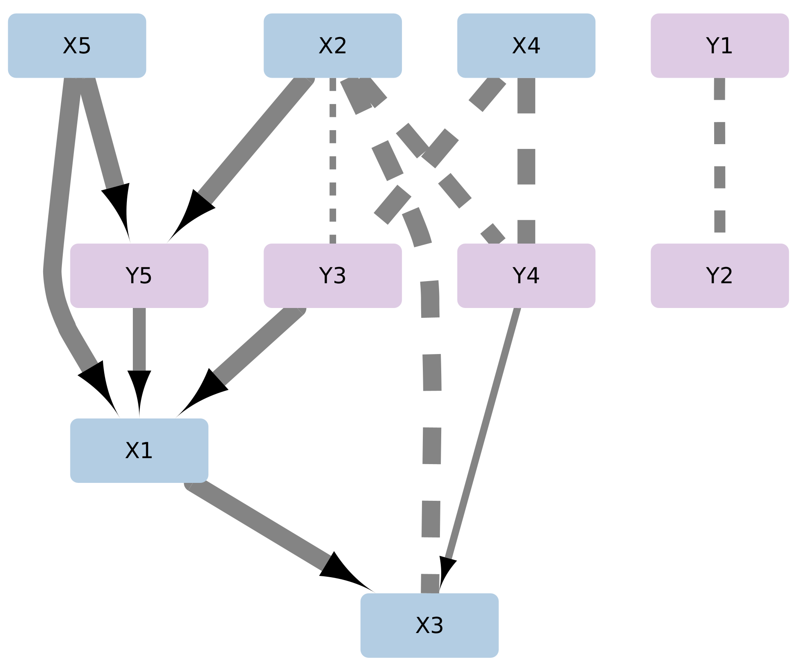

# rCausalMGM

## Requirements

For Windows and Linux users, the rCausalMGM package can be installed directly in R (>=4.0) following the instructions outlined below. MacOS users need to install a `gfortran` compiler in order to build the rCausalMGM package. `gfortran` compilers for a variety of Mac OS versions can be found [here](https://github.com/fxcoudert/gfortran-for-macOS/releases).

## Installing the rCausalMGM package

The rCausalMGM package can be installed directly from its GitHub repository by executing the following code:


```r
if (!require(devtools, quietly = TRUE))
    install.packages("devtools")

devtools::install_github("tyler-lovelace1/rCausalMGM")
```

```
## Skipping install of 'rCausalMGM' from a github remote, the SHA1 (8e6055a4) has not changed since last install.
##   Use `force = TRUE` to force installation
```

## Loading the rCausalMGM package and generating a toy dataset

We begin by generating a toy synthetic dataset. This synthetic dataset contains 10,000 samples from 10 features (5 continuous and 5 categorical) with an average graph degree of 3. This dataset has a large enough sample size for a small graph to enable perfect recovery of the Markov equivalence class of the corresponding causal DAG.


```r
library(rCausalMGM)

sim <- simRandomDAG(n=10000, p=10, seed=43)

print(head(sim$data))
```

```
##           X1          X2          X3          X4         X5 Y1 Y2 Y3 Y4 Y5
## 1  0.5106936 -0.31217097 -1.37310518  0.10944494  0.2293237  A  C  A  C  B
## 2  0.6689763  0.34839542  0.19243979 -0.02131115 -0.5827454  A  A  C  A  C
## 3  0.7668640 -0.71424403  0.04017236  0.50243924 -0.9796614  A  B  C  A  C
## 4 -0.9100317 -1.50651918  0.16829495 -1.35566681 -0.1524372  C  B  B  B  A
## 5 -2.5742462  0.37828708  1.90839210 -0.27867740  2.5055206  C  B  B  A  A
## 6  0.6130401 -0.06276592  0.91054819 -0.19054777 -0.4605763  B  A  C  A  A
```

```r
print(sim$graph)
```

```
## Algorithm:  Ground Truth 
## Nodes:  10 
## Edges:  15 
##   Directed:  15 
##   Undirected:  0
```

## Learning an initial estimate of the undirected causal skeleton with MGM

Oftentimes, especially in high-dimensional dataset, it can be beneficial to learn an intial undirected estimate of the interactions in the causal graph. There are two primary reasons for this: (1) the assumption of faithfulness required for learning undirected graphical models such as GLASSO and MGM is less restrictive than the one required for causal discovery algorithms and (2) it can dramatically speed up causal discovery in high-dimensional settings by removing many possible edge from consideration. We can learn an MGM for our simulated dataset as shown below. The L_1 regularization parameter `lambda` can be used to control graph sparsity.


```r
ig <- mgm(sim$data, lambda=0.05, verbose=T)
```

```
##   Learning MGM for lambda = { 0.05 0.05 0.05 }
##     Iter: 0 ||dx||/||x||: 0.126811 loss: 7.08697
##     Iter: 10 ||dx||/||x||: 0.0574237 loss: 5.61811
##     Iter: 20 ||dx||/||x||: 0.0141939 loss: 5.48833
##     Iter: 30 ||dx||/||x||: 0.00171399 loss: 5.48743
##     Iter: 40 ||dx||/||x||: 0.000790968 loss: 5.48729
##     Iter: 50 ||dx||/||x||: 0.000263371 loss: 5.48728
##     Iter: 60 ||dx||/||x||: 0.000115939 loss: 5.48728
##     Iter: 70 ||dx||/||x||: 2.65418e-05 loss: 5.48728
##     Iter: 80 ||dx||/||x||: 2.91426e-05 loss: 5.48728
##     Iter: 90 ||dx||/||x||: 3.55957e-05 loss: 5.48728
##     Iter: 100 ||dx||/||x||: 1.53546e-05 loss: 5.48728
##     Iter: 102 ||dx||/||x||: 9.85928e-07 loss: 5.48728
##   MGM Elapsed Time =  8.5 s
```

```r
print(ig)
```

```
## Algorithm:  MGM 
## Nodes:  10 
## Edges:  22 
## lambda = {0.05, 0.05, 0.05}
```

```r
plot(ig)
```

<!-- --> 


## Recovering the Completed Partially Directed Acyclic Graph (CPDAG) with PC-Stable

In the causally sufficient case and with asymptotically large sample sizes, the PC-Stable algorithm can identify the Markov equivalence class of the causal DAG. On this toy dataset, we can perfectly recover this Markov equivalence class, also known as the CPDAG. Here, we run the majority PC-Stable (MPC-Stable) algorithm to learn the causal graph. The majority in MPC-Stable refers to the majority rule for orienting colliders, which requires the majority of conditional independence tests performed for a given unshielded triple to agree that it is a collider for it to be oriented as such.


```r
g <- pcStable(sim$data, initialGraph=ig, 
              orientRule="majority", alpha = 0.05, verbose=T)
```

```
## Starting PC-Stable algorithm...
##   Starting FAS Stable...
##     Searching at depth 0...
##     Searching at depth 1...
##     Searching at depth 2...
##     Searching at depth 3...
##   FAS Stable Elapsed Time =  0.26 s
##     Filling Triple Map...
##   Orienting colliders...
##   Orienting implied edges...
##   PC-Stable Elapsed Time =  0.85 s
```

```r
print(g)
```

```
## Algorithm:  MGM-MPC-Stable 
## Nodes:  10 
## Edges:  15 
##   Directed:  12 
##   Undirected:  3 
## lambda = {0.05, 0.05, 0.05}
## alpha =  0.05
```

```r
plot(g)
```

<!-- --> 

### Structural Hamming Distance (SHD) as a measure of causal structure recovery

Since we know the ground truth for this synthetic dataset, we can compare the learned graph `g` with its CPDAG. We do this using the Structural Hamming Distance (SHD), which is a measure for the distance between two graphs. The SHD is the total number of modifications required to convert one graph to another through a limited set of operations. The possible operations are the addition or subtraction of an undirected edge or the transformation of an undirected edge to a directed one or vice versa. As this is a distance metric, lower is better, with an SHD of zero indicating that the two graphs are identical.


```r
sim$cpdag <- cpdag(sim$graph)

print(sim$cpdag)
```

```
## Algorithm:  Ground Truth 
## Nodes:  10 
## Edges:  15 
##   Directed:  12 
##   Undirected:  3
```

```r
plot(sim$cpdag)
```

<!-- --> 

```r
print(paste0('SHD: ', SHD(g, sim$cpdag)))
```

```
## [1] "SHD: 0"
```

### Saving a graph learned by rCausalMGM

An rCausalMGM graph object can be saved as a `.txt` file and reloaded later, as shown below:


```r
saveGraph(g, 'mpc_graph.txt')

g2 <- loadGraph("mpc_graph.txt")

par(mfrow=c(1,2))
plot(g)
plot(g2)
```

<!-- --> 


### Saving the learned graph as a `.sif` file for visualization in Cytoscape

For the purpose of visualization, we can save also the learned graph as `.sif` file using the following command. This file format can be loaded into external visualization tools such as Cytoscape to create customizable visualizations. Edge interactions are coded as follows:

* A undir B  :  A --- B
* A dir B    :  A --> B
* A bidir B  :  A <-> B
* A cc B     :  A o-o B
* A ca B     :  A o-> B


```r
saveGraph(g, 'mpc_graph.sif')
```


```r
knitr::include_graphics(c('mpc_graph.png'))
```


**Figure 1:** The causal graph learned by MPC-Stable after being visualized in Cytoscape. The blue nodes are continuous, while the purple nodes are categorical.

## Learning causal graphs on finite sample sizes

In practice, most real datasets have much lower sample sizes. This leads to less accurate recovery of the causal graph, and makes the selection of the regularization parameter `lambda`, orientation rule, and the significance threshold `alpha` more important. Here, we demonstrate how the BIC score can be used to select an undirected MGM model. 


```r
ig.path <- mgmPath(sim$data[1:300,])

par(mfrow=c(1,3))
plot(ig.path)
plot(ig.path$graph.aic)
plot(ig.path$graph.bic)
```

<!-- --> 

```r
print(t(sapply(ig.path[1:2], prMetricsAdjacency, moral(sim$graph))))
```

```
##           adjPrecision adjRecall     adjF1     adjMCC
## graph.bic    0.8333333      0.75 0.7894737  0.6390097
## graph.aic    0.4285714      0.90 0.5806452 -0.1195229
```

We can see that the BIC selected model performed much better than the AIC selected model when compared to the true moralized causal graph.

We can use this BIC selected graph as an initial graph when learning a causal graph with PC-Stable. However, at lower sample sizes, the output is more sensitive to the selection of orientaion rules and significance thresholds. For a given value of `alpha`, all PC algorithms will learn the same skeleton, and will only differ in their orientations. We can utilize this fact to avoid performing unnecessary additional conditional independence tests when learning a graph with multiple orientation rules by supplying a list of desired rules to the `pcStable` function.


```r
g.list <- pcStable(sim$data[1:300,], initialGraph = ig.path$graph.bic, 
                   orientRule=c("majority", "maxp", "conservative"))

par(mfrow=c(1,3))
plot(g.list$majority)
plot(g.list$maxp)
plot(g.list$conservative)
```

<!-- --> 

```r
print(t(sapply(g.list, allMetrics, sim$cpdag)))
```

```
##              SHD adjPrecision adjRecall     adjF1    adjMCC orientPrecision
## majority      13            1 0.8666667 0.9285714 0.9013878       0.5555556
## maxp           7            1 0.8666667 0.9285714 0.9013878       1.0000000
## conservative  13            1 0.8666667 0.9285714 0.9013878       0.6000000
##              orientRecall  orientF1 orientMCC
## majority        0.4545455 0.5000000 0.1951075
## maxp            0.6363636 0.7777778 0.7087964
## conservative    0.2727273 0.3750000 0.1747396
```

```r
print(t(sapply(g.list, prMetricsCausal, sim$graph)))
```

```
##              causalPrecision causalRecall  causalF1
## majority           0.6666667    0.4000000 0.5000000
## maxp               1.0000000    0.4666667 0.6363636
## conservative       0.6000000    0.2000000 0.3000000
```

Different values of `alpha` will affect both the sparsity of the learned graph, and the orientation of the edges. For example, we run the PC-Max algorithm at `alpha = 0.01`, `alpha = 0.05`, and `alpha = 0.15`.


```r
par(mfrow=c(1,3))

g1 <- pcStable(sim$data[1:300,], initialGraph = ig.path$graph.bic, 
               orientRule="maxp", alpha=0.01)
plot(g1)
g2 <- pcStable(sim$data[1:300,], initialGraph = ig.path$graph.bic, 
               orientRule="maxp", alpha=0.05)
plot(g2)
g3 <- pcStable(sim$data[1:300,], initialGraph = ig.path$graph.bic, 
               orientRule="maxp", alpha=0.15)
plot(g3)
```

<!-- --> 

```r
g.list <- list(a01=g1, a05=g2, a15=g3)

print(t(sapply(g.list, allMetrics, sim$cpdag)))
```

```
##     SHD adjPrecision adjRecall     adjF1    adjMCC orientPrecision orientRecall
## a01  15    1.0000000 0.7333333 0.8461538 0.8043997       0.5555556    0.5000000
## a05   7    1.0000000 0.8666667 0.9285714 0.9013878       1.0000000    0.6363636
## a15  16    0.9285714 0.8666667 0.8965517 0.8485553       0.5000000    0.3636364
##      orientF1 orientMCC
## a01 0.5263158 0.1687899
## a05 0.7777778 0.7087964
## a15 0.4210526 0.1037999
```

```r
print(t(sapply(g.list, prMetricsCausal, sim$graph)))
```

```
##     causalPrecision causalRecall  causalF1
## a01       0.5555556    0.3333333 0.4166667
## a05       1.0000000    0.4666667 0.6363636
## a15       0.5555556    0.3333333 0.4166667
```

## Bootstrapping causal discovery algorithms to quantify edge stability

While it is not possible to analytically assign a certainty or p-value to a causal graph, we can use bootstrapping to get an idea of how stable a graph and its edges are. With bootstrapping, we resample the dataset with replacement many times, and run our causal algorithm on those resampled
datasets. In practice, the default is to sample a dataset of `0.632 * N` samples without replacement instead, as sampling with replacement can lead to errors in conditional independence testing. We then calculate the frequency with which each edge appears across these bootstrap samples, which we can use as an estimate of the probability that a given edge appears in the causal graph given our dataset. The `bootstrap` function returns an ensemble graph based on these edge stabilities, returning a graph consisting of the most likely orientation for each edge according to the bootstrap. 


```r
g <- pcStable(sim$data[1:300,], initialGraph = ig.path$graph.bic, 
              orientRule="maxp", alpha=0.05)

g.boot <- bootstrap(sim$data[1:300,], graph = g, numBoots = 200)

plot(g.boot)
```

<!-- --> 

```r
print(head(g.boot$stabilities))
```

```
##   var1 interaction var2 undir right.dir left.dir bidir right.partdir
## 1   X1         -->   X5 0.160     0.770    0.070     0             0
## 2   X1         <--   Y3 0.250     0.205    0.545     0             0
## 3   X2         -->   Y5 0.310     0.565    0.125     0             0
## 4   X4         ---   Y3 0.625     0.130    0.245     0             0
## 5   X5         <--   Y5 0.100     0.180    0.720     0             0
## 6   X2         -->   X3 0.045     0.530    0.420     0             0
##   left.partdir nondir  none
## 1            0      0 0.000
## 2            0      0 0.000
## 3            0      0 0.000
## 4            0      0 0.000
## 5            0      0 0.000
## 6            0      0 0.005
```

```r
g.list <- list(original=g, bootstrapped=g.boot)

print(t(sapply(g.list, allMetrics, sim$cpdag)))
```

```
##              SHD adjPrecision adjRecall     adjF1    adjMCC orientPrecision
## original       7            1 0.8666667 0.9285714 0.9013878       1.0000000
## bootstrapped  13            1 0.7333333 0.8461538 0.8043997       0.6666667
##              orientRecall  orientF1 orientMCC
## original        0.6363636 0.7777778 0.7087964
## bootstrapped    0.6000000 0.6315789 0.3544588
```

```r
print(t(sapply(g.list, prMetricsCausal, sim$graph)))
```

```
##              causalPrecision causalRecall  causalF1
## original           1.0000000    0.4666667 0.6363636
## bootstrapped       0.6666667    0.4000000 0.5000000
```

Alternatively, these stabilities can be combined with the original causal graph learned on the full dataset to assess the likelihood of the adjacencies and/or orientations in that graph. To do this, we need to take the stability information from the bootstrap result, pair it with the original causal graph, and then output the edge interactions as a `data.frame`. We can do this with the `graphTable` function, and then save this output as a `.csv`.

### Visualizing causal structures with bootstrap adjacency and orientation frequencies

Here, we output both the ensemble and original graph as a `.csv` file for visualization in Cytoscape with our bootstrapped adjacency and orientation stability information. We can also create a barplot showing the adjacency frequency (dark grey) and orientation frequency (red) for each of the edges in the original graph.


```r
g.table <- graphTable(g, g.boot$stabilities)

write.csv(g.table, 'pcmax_graph_stabs.csv', quote=FALSE, row.names=FALSE)

print(head(g.table))
```

```
##   source target interaction adjFreq orientFreq
## 1     X1     X3         dir   0.970      0.735
## 2     X2     X3       undir   0.995      0.045
## 3     X2     Y3       undir   0.370      0.040
## 4     X2     Y4       undir   0.935      0.060
## 5     X2     Y5         dir   1.000      0.565
## 6     X4     Y3       undir   1.000      0.625
```

```r
g.table$Edge <- g$edges

g.table <- g.table[order(g.table$adjFreq, g.table$orientFreq),]

g.table$Edge <- factor(g.table$Edge, levels=g.table$Edge)

library(ggplot2)

print(
  ggplot(g.table, aes(adjFreq, Edge)) + 
    geom_bar(stat="identity") +
    geom_bar(mapping=aes(orientFreq, Edge), stat="identity", fill="red") +
    xlab("Frequency") + 
    theme_classic()
  )
```

<!-- --> 


```r
knitr::include_graphics(c('pcmax_graph_stabs_adj.png', 'pcmax_graph_stabs_orient.png'))
```




**Figure 2:** A pair of representations of the original causal graph learned by PC-Max on the simulated dataset. Edge thickness represents adjacency frequency from 0 to 1 (left), and orientation frequency from 0 to 1 (right).

While the adjacencies for the original graph are mostly quite stable, with only X2 --- Y3 and Y4 --> X3 ocurring in less than 50% of bootstrap graphs, the orientations are much less stable. This is an expected outcome in low sample sizes, where causal orientations are significantly more difficult to learn than adjacencies. The ensemble graph output by `bootstrap` could also be used as the estimate of the causal model, but it is not guaranteed to be a valid CPDAG.

## Utilizing prior knowledge to improve causal discovery

In some settings, there may be sufficient domain knowledge available to put some constraints on our causal discovery algorithms. In some cases, it may be possible forbid or require the presence of certain directed edges. In others, we could have partial information about the causal order of variables in a dataset, such as when they are measured at different time steps or reflect variables determined well before other measurements in the dataset (such as gender, race, or SNPs). Using our simulated dataset, we'll demonstrate how prior knowledge can be integrated with our causal discovery methods. Knowledge can be provided in three ways:

* Tiers: ordered sets of variables where variables in tier t can only be ancestors of variables in tiers t+1, ..., T and descendants of variables in tiers 1, ..., t-1. Tiers may be modified so that they can not form edges within a given tier using the `forbiddenWithinTier` argument.
* Forbidden Edges: Directly forbid certain directed edges. If the adjacency is completely impossible, the user must forbid both directions.
* Required Edges: Explicitly require the presence of a directed edge.


```r
K <- createKnowledge(
  tiers = list(c("Y3", "X4", "X2"), c("X5", "Y2", "Y4", "Y5"), c("X3", "X1", "Y1")),
  forbidden = list(c("X2", "X5"), c("X5", "X2")),
  required = list(c("Y3", "X2"))
)

print(K)
```

```
## Prior Knowledge:
##   Tiers:
##     1: Y3 X4 X2
##     2: X5 Y2 Y4 Y5
##     3: X3 X1 Y1
##   Forbidden:
##     X2 --> X5
##     X5 --> X2
##   Required:
##     Y3 --> X2
```

```r
g.list <- pcStable(sim$data[1:300,], knowledge=K, 
                   initialGraph = ig.path$graph.bic, 
                   orientRule=c("majority", "maxp", "conservative"))

par(mfrow=c(1,3))
plot(g.list$majority)
plot(g.list$maxp)
plot(g.list$conservative)
```

<!-- --> 

```r
print(t(sapply(g.list, allMetrics, sim$cpdag)))
```

```
##              SHD adjPrecision adjRecall     adjF1 adjMCC orientPrecision
## majority       8    0.9333333 0.9333333 0.9333333    0.9       0.7692308
## maxp           8    0.9333333 0.9333333 0.9333333    0.9       0.7692308
## conservative   7    0.9333333 0.9333333 0.9333333    0.9       0.8333333
##              orientRecall  orientF1 orientMCC
## majority        0.9090909 0.8333333 0.7174348
## maxp            0.9090909 0.8333333 0.7174348
## conservative    0.9090909 0.8695652 0.7810706
```

```r
print(t(sapply(g.list, prMetricsCausal, sim$graph)))
```

```
##              causalPrecision causalRecall  causalF1
## majority           0.8571429          0.8 0.8275862
## maxp               0.8571429          0.8 0.8275862
## conservative       0.9230769          0.8 0.8571429
```


## Scalable learning of high-dimensional causal graphs

Many biomedical datasets involve large numbers of features and relatively small sample sizes. Typically, implementations of constraint-based causal discovery algorithms scale poorly to high-dimensional datasets. Efficient parallelization and a `C++` backend for the `rCausalMGM` package make it faster than most, but it still slows down significantly as the number of features increases when sample size is held constant. Using a new synthetic dataset with 300 samples and 500 features (250 continuous and 250 categorical), we can explore the performance of `rCausalMGM` in the high-dimensional setting.


```r
simLarge <- simRandomDAG(n=300, p=500, seed=43)
simLarge$cpdag <- cpdag(simLarge$graph)

#### Small dataset (n=300, p=10)
print(system.time(g1 <- pcStable(sim$data[1:300,], orientRule="maxp", alpha=0.01)))
```

```
##    user  system elapsed 
##   0.063   0.163   0.022
```

```r
print(g1)
```

```
## Algorithm:  PC-Max 
## Nodes:  10 
## Edges:  11 
##   Directed:  9 
##   Undirected:  2 
## alpha =  0.01
```

```r
#### Large dataset (n=300, p=500)
print(system.time(g2 <- pcStable(simLarge$data, orientRule="maxp", alpha=0.01)))
```

```
##    user  system elapsed 
##  78.068 100.939  13.365
```

```r
print(g2)
```

```
## Algorithm:  PC-Max 
## Nodes:  500 
## Edges:  665 
##   Directed:  599 
##   Undirected:  66 
## alpha =  0.01
```

```r
print(t(data.frame(small=allMetrics(g1, sim$cpdag), large=allMetrics(g2, simLarge$cpdag))))
```

```
##       SHD adjPrecision adjRecall     adjF1    adjMCC orientPrecision
## small  15    1.0000000 0.7333333 0.8461538 0.8043997       0.5555556
## large 804    0.8466165 0.7506667 0.7957597 0.7960530       0.7182540
##       orientRecall  orientF1 orientMCC
## small    0.5000000 0.5263158 0.1687899
## large    0.7669492 0.7418033 0.5455982
```

As expected, learning high-dimensional causal graphs is significantly more difficult than small ones at the same sample size. Next, we discuss two approaches that both enable us to learn causal graphical models quicker and improve the accuracy of graph recovery.

### Learning causal graphical models with adjacency false discovery control

Another approach to mitigating the errors that occur due to the high-dimensionality of the dataset and the correspondingly large number of conditional independence tests performed is to preform FDR correction when learning the adjacencies of the causal graph. This can be applied in conjunction with using MGM to learn an initial estimate of the graph skeleton, or on its own.


```r
#### FDR < 0.05
print(system.time(g1 <- pcStable(simLarge$data, orientRule="maxp", alpha=0.05, fdr=T)))
```

```
##    user  system elapsed 
##  61.693  71.363  10.887
```

```r
#### FDR < 0.1
print(system.time(g2 <- pcStable(simLarge$data, orientRule="maxp", alpha=0.1, fdr=T)))
```

```
##    user  system elapsed 
##  65.187  82.524  12.479
```

```r
#### FDR < 0.2
print(system.time(g3 <- pcStable(simLarge$data, orientRule="maxp", alpha=0.2, fdr=T)))
```

```
##    user  system elapsed 
##  83.034 103.034  15.736
```

```r
g.list <- list(fdr05=g1, fdr1=g2, fdr2=g3)

print(t(sapply(g.list, allMetrics, simLarge$cpdag)))
```

```
##       SHD adjPrecision adjRecall     adjF1    adjMCC orientPrecision
## fdr05 653    0.9666667 0.6960000 0.8093023 0.8193793       0.8019560
## fdr1  684    0.9222973 0.7280000 0.8137109 0.8184710       0.7735426
## fdr2  835    0.8318713 0.7586667 0.7935844 0.7932440       0.6990291
##       orientRecall  orientF1 orientMCC
## fdr05    0.7575058 0.7790974 0.6307420
## fdr1     0.7565789 0.7649667 0.5997417
## fdr2     0.7547170 0.7258065 0.5157064
```

As we can see, the adjacency FDR (equal to `1 - adjPrecision`) is successfully controlled at the specified levels, and the resulting causal graphical models have much lower SHDs from the ground truth CPDAGs

### Learning an initial skeleton with Mixed Graphical Models (MGM) can accelerate causal discovery in high-dimensional settings

Utilizing the `mgm` function, we can learn an initial skeleton to use as the starting point for our causal discovery algorithms. As mentioned above, this accelerates constraint-based causal discovery methods by eliminating most possible edges from consideration, reducing the number of conditional independence tests that are necessary to learn the causal graph. It can also result in more accurate causal graphical models.


```r
system.time(ig <- mgm(simLarge$data, lambda=0.27))
```

```
##    user  system elapsed 
##  43.120  55.470   6.457
```

```r
system.time(g.mgmpcm <- pcStable(simLarge$data, orientRule="maxp", 
                                 initialGraph = ig, alpha = 0.01))
```

```
##    user  system elapsed 
##  14.650  30.930   3.632
```

```r
print(g.mgmpcm)
```

```
## Algorithm:  MGM-PC-Max 
## Nodes:  500 
## Edges:  589 
##   Directed:  516 
##   Undirected:  73 
## lambda = {0.27, 0.27, 0.27}
## alpha =  0.01
```

```r
allMetrics(g.mgmpcm, simLarge$cpdag)
```

```
##             SHD    adjPrecision       adjRecall           adjF1          adjMCC 
##     735.0000000       0.9100170       0.7146667       0.8005975       0.8054432 
## orientPrecision    orientRecall        orientF1       orientMCC 
##       0.7334755       0.7695749       0.7510917       0.5661084
```


### Efficient selection of the regularization parameter `lambda` for MGM

A key difficulty with using MGM is efficiently selecting the right regularization parameter. The `rCausalMGM` package offers multiple options to pick a suitable value for `lambda`: the Bayesian Information Criterion (BIC), Akaike Information Criterion (AIC), K-fold cross-validation, and Stable Edge-specific Penalty Selection (StEPS).

#### Using information criteria for MGM model selection

First, we demonstrate the information criteria-based selection methods, BIC and AIC. These methods simply involve solving a solution path for MGM over a range of lambda values, and can be computed together using the `mgmPath` function.


```r
sim50 <- simRandomDAG(n=300, p=50, seed=43)
sim50$cpdag <- cpdag(sim50$graph)

ig.path <- mgmPath(sim50$data)
```

We can select the regularization parameter `lambda` by finding the minima of the information criteria.


```r
print(ig.path)
```

```
## Minimum BIC graph:
##   Index: 13
## 
## Algorithm:  MGM 
## Nodes:  50 
## Edges:  87 
## lambda = {0.2178587, 0.2178587, 0.2178587}
## 
## Minimum AIC graph:
##   Index: 15
## 
## Algorithm:  MGM 
## Nodes:  50 
## Edges:  125 
## lambda = {0.1771939, 0.1771939, 0.1771939}
```

```r
plot(ig.path)
```

<!-- --> 

```r
print(t(sapply(ig.path[1:2], prMetricsAdjacency, moral(sim50$graph))))
```

```
##           adjPrecision adjRecall     adjF1    adjMCC
## graph.bic    0.7586207 0.4230769 0.5432099 0.5235898
## graph.aic    0.6000000 0.4807692 0.5338078 0.4779540
```
**Figure 4:** The BIC (red) and AIC (blue) scores versus the log-transformed regularization parameter, `log10(lambda)`. The minima are marked by vertical lines and correspond to the MGM model selected by the BIC and AIC respectively.

#### Using K-fold cross-validation for MGM model selection

Next, we demonstrate the use of 5-fold cross-validation to select the value of `lambda`. Similarly to the process with information criteria, we solve a solution path for MGM over a range of lambda values. However, we now do this K times, one for each training set, and evaluate model score on the held out test data. The `mgmCV` function implements this process and returns the graph that minimizes the test loglikelihood, as well as the sparsest model within one standard error of the minima (1SE rule).


```r
ig.cv <- mgmCV(sim50$data, nfolds=5)
```

We can select the regularization parameter `lambda` by finding the minima of the information criteria.


```r
print(ig.cv)
```

```
## Minimum cross-validation log(pseudo-likelihood) graph:
##   Index: 20
##   Average Markov Blanket Size: 17.04
## 
## Algorithm:  MGM 
## Nodes:  50 
## Edges:  426 
## lambda = {0.1057142, 0.1057142, 0.1057142}
## 
## One standard error above the minimum cross-validation log(pseudo-likelihood) graph:
##   Index: 16
##   Average Markov Blanket Size: 6.8
## 
## Algorithm:  MGM 
## Nodes:  50 
## Edges:  170 
## lambda = {0.1598033, 0.1598033, 0.1598033}
```

```r
plot(ig.cv)
```

<!-- --> 

```r
print(t(sapply(ig.cv[1:2], prMetricsAdjacency, moral(sim50$graph))))
```

```
##           adjPrecision adjRecall     adjF1    adjMCC
## graph.min    0.2816901 0.7692308 0.4123711 0.3380678
## graph.1se    0.5117647 0.5576923 0.5337423 0.4628994
```
**Figure 5:** The average test negative log-psuedolikelihood versus the log-transformed regularization parameter, `log10(lambda)`. The error bars represent the standard error of the estimate of the test negative log-psuedolikelihood. The vertical lines represent the models selected at the minima and by the 1SE rule.

#### Using stability-based approaches for MGM model selection

Another approach to model selection implemented in `rCausalMGM` are the stability-based approaches StARS and StEPS. These methods use the stability of the learned MGMs across subsamples of the dataset to select the best model rather than the likelihood of the models. It has been shown to be particularly effective in high-dimensional datasets where information criteria and k-fold cross-validation tend to underpenalize dense models. The StARS method (Stability Approach to Regularization Selection) selects a single regularization parameter `lambda` for the whole MGM, while the StEPS method (Stable Edge-specific Penalty Selection) selects an individual regularization parameter for each edge type (continuous-continuous, continuous-discrete, and discrete-discrete).


```r
ig.steps <- steps(sim50$data, verbose = TRUE)
```

```
## Running STEPS for 30 lambdas from 0.0376272 to 0.752545...
##   Testing lambda = 0.752545
##   Overall instability for lambda = 0.752545:  0.0023551
##   Instabilities for lambda = 0.752545:  {0.0035, 0.002936, 0}
##   Testing lambda = 0.678686
##   Overall instability for lambda = 0.678686:  0.00383265
##   Instabilities for lambda = 0.678686:  {0.00473333, 0.00524, 0}
##   Testing lambda = 0.612077
##   Overall instability for lambda = 0.612077:  0.0047551
##   Instabilities for lambda = 0.612077:  {0.0085, 0.00524, 0}
##   Testing lambda = 0.552005
##   Overall instability for lambda = 0.552005:  0.00476735
##   Instabilities for lambda = 0.552005:  {0.00931667, 0.004872, 0}
##   Testing lambda = 0.497829
##   Overall instability for lambda = 0.497829:  0.00443265
##   Instabilities for lambda = 0.497829:  {0.0083, 0.004144, 0.00116667}
##   Testing lambda = 0.448969
##   Overall instability for lambda = 0.448969:  0.00584898
##   Instabilities for lambda = 0.448969:  {0.00975, 0.00532, 0.00305}
##   Testing lambda = 0.404905
##   Overall instability for lambda = 0.404905:  0.00701633
##   Instabilities for lambda = 0.404905:  {0.0116167, 0.00592, 0.0047}
##   Testing lambda = 0.365166
##   Overall instability for lambda = 0.365166:  0.0105673
##   Instabilities for lambda = 0.365166:  {0.0197, 0.007488, 0.00785}
##   Testing lambda = 0.329327
##   Overall instability for lambda = 0.329327:  0.0156816
##   Instabilities for lambda = 0.329327:  {0.0259167, 0.013544, 0.0099}
##   Testing lambda = 0.297005
##   Overall instability for lambda = 0.297005:  0.0245633
##   Instabilities for lambda = 0.297005:  {0.0362667, 0.023048, 0.0160167}
##   Testing lambda = 0.267856
##   Overall instability for lambda = 0.267856:  0.0384857
##   Instabilities for lambda = 0.267856:  {0.0494, 0.038416, 0.0277167}
##   Testing lambda = 0.241567
##   Overall instability for lambda = 0.241567:  0.0590735
##   Instabilities for lambda = 0.241567:  {0.0644833, 0.061432, 0.04875}
##   Testing lambda = 0.217859
##   Overall instability for lambda = 0.217859:  0.0890857
##   Instabilities for lambda = 0.217859:  {0.08395, 0.092432, 0.08725}
## Selected lambdas: { 0.267856, 0.267856, 0.241567 }
## StARS lambda: 0.267856
```

The `steps` method returns both the graph selected by StEPS and StARS.


```r
print(ig.steps)
```

```
## StEPS selected graph:
## 
## Algorithm:  MGM 
## Nodes:  50 
## Edges:  64 
## lambda = {0.2678559, 0.2678559, 0.2415673}
## 
## 
## StARS selected graph:
## 
## Algorithm:  MGM 
## Nodes:  50 
## Edges:  61 
## lambda = {0.2678559, 0.2678559, 0.2678559}
```

```r
plot(ig.steps)
```

<!-- --> 

```r
print(t(sapply(ig.steps[1:2], prMetricsAdjacency, moral(sim50$graph))))
```

```
##             adjPrecision adjRecall     adjF1    adjMCC
## graph.steps    0.9218750 0.3782051 0.5363636 0.5595876
## graph.stars    0.9180328 0.3589744 0.5161290 0.5429719
```
**Figure 6:** The instability of each edge type versus the log-transformed regularization parameter, `log10(lambda)`. The vertical lines represent the lambda values selected by StEPS (for the individual edge types) and StARS (for the overall instability, black).

#### Utilizing selected MGMs for causal discovery

Finally, we can use the selected MGM graphs as initial skeletons for learning the causal graph for the simulated dataset `sim50$data`. Although the `alpha` parameter is the same across all runs of PC-Stable, the different initial skeletons lead to large differences in graph sparsity and the accuracy of graph recovery.


```r
g <- pcStable(sim50$data, orientRule="maxp", alpha = 0.01)
print(g)
```

```
## Algorithm:  PC-Max 
## Nodes:  50 
## Edges:  55 
##   Directed:  49 
##   Undirected:  6 
## alpha =  0.01
```

```r
g.bic <- pcStable(sim50$data, initialGraph = ig.path$graph.bic, 
                  orientRule="maxp", alpha = 0.01)
print(g.bic)
```

```
## Algorithm:  MGM-PC-Max 
## Nodes:  50 
## Edges:  56 
##   Directed:  50 
##   Undirected:  6 
## lambda = {0.2178587, 0.2178587, 0.2178587}
## alpha =  0.01
```

```r
g.aic <- pcStable(sim50$data, initialGraph = ig.path$graph.aic,
                  orientRule="maxp", alpha = 0.01)
print(g.aic)
```

```
## Algorithm:  MGM-PC-Max 
## Nodes:  50 
## Edges:  56 
##   Directed:  50 
##   Undirected:  6 
## lambda = {0.1771939, 0.1771939, 0.1771939}
## alpha =  0.01
```

```r
g.min <- pcStable(sim50$data, initialGraph = ig.cv$graph.min, 
                  orientRule="maxp", alpha = 0.01)
print(g.min)
```

```
## Algorithm:  MGM-PC-Max 
## Nodes:  50 
## Edges:  55 
##   Directed:  49 
##   Undirected:  6 
## lambda = {0.1057142, 0.1057142, 0.1057142}
## alpha =  0.01
```

```r
g.1se <- pcStable(sim50$data, initialGraph = ig.cv$graph.1se, 
                  orientRule="maxp", alpha = 0.01)
print(g.1se)
```

```
## Algorithm:  MGM-PC-Max 
## Nodes:  50 
## Edges:  55 
##   Directed:  49 
##   Undirected:  6 
## lambda = {0.1598033, 0.1598033, 0.1598033}
## alpha =  0.01
```

```r
g.steps <- pcStable(sim50$data, initialGraph = ig.steps$graph.steps, 
                    orientRule="maxp", alpha = 0.01)
print(g.steps)
```

```
## Algorithm:  MGM-PC-Max 
## Nodes:  50 
## Edges:  55 
##   Directed:  49 
##   Undirected:  6 
## lambda = {0.2678559, 0.2678559, 0.2415673}
## alpha =  0.01
```

```r
g.stars <- pcStable(sim50$data, initialGraph = ig.steps$graph.stars,
                    orientRule="maxp", alpha = 0.01)
print(g.stars)
```

```
## Algorithm:  MGM-PC-Max 
## Nodes:  50 
## Edges:  53 
##   Directed:  49 
##   Undirected:  4 
## lambda = {0.2678559, 0.2678559, 0.2678559}
## alpha =  0.01
```

```r
g.list <- list(NoMGM=g, AIC=g.aic, BIC=g.bic, CVMin=g.min, 
               CV1SE=g.1se, StARS=g.stars, StEPS=g.steps)

print(t(sapply(g.list, allMetrics, sim50$cpdag)))
```

```
##       SHD adjPrecision adjRecall     adjF1    adjMCC orientPrecision
## NoMGM  76    0.9454545 0.6933333 0.8000000 0.7996689       0.6808511
## AIC    74    0.9464286 0.7066667 0.8091603 0.8081402       0.6875000
## BIC    74    0.9464286 0.7066667 0.8091603 0.8081402       0.6875000
## CVMin  76    0.9454545 0.6933333 0.8000000 0.7996689       0.6808511
## CV1SE  76    0.9454545 0.6933333 0.8000000 0.7996689       0.6808511
## StARS  70    0.9622642 0.6800000 0.7968750 0.7992351       0.7446809
## StEPS  66    0.9636364 0.7066667 0.8153846 0.8161120       0.7500000
##       orientRecall  orientF1 orientMCC
## NoMGM    0.7441860 0.7111111 0.4930490
## AIC      0.7500000 0.7173913 0.5029287
## BIC      0.7500000 0.7173913 0.5029287
## CVMin    0.7441860 0.7111111 0.4930490
## CV1SE    0.7441860 0.7111111 0.4930490
## StARS    0.8139535 0.7777778 0.6048684
## StEPS    0.8181818 0.7826087 0.6183193
```

### Model selection for causal graphical models

Similar to the undirected MGM, causal discovery algorithms such as PC-Stable and FCI-Stable have a hyperparameter affecting graph sparsity (`alpha`), but it also has a hyperparameter that effects edge orientation (`orientRule`). We can select these models in much the same way as with MGM using k-fold cross-validation or stability-based approaches. Here, we focus on cross-validation, as it tends to perform best for selecting causal graphical models.

#### Model selection with no MGM or a pre-selected MGM

We can use the `pcCV` or `fciCV` functions (for PC-Stable and FCI-Stable respectively) to select the best value of `alpha` and `orientRule` with cross-validation. We can optionally provide an intial graph as with the `pcStable` or `fciStable` functions. Here, we demonstrate the use of cross-validation without an initial graph and with the StEPS selected MGM. We allow the range of `alpha` values to go higher when using the StEPS selected MGM because the sparsity of the StEPS selected MGM prevents the graph from becoming overly dense at high values of `alpha`.


```r
alphas <- c(0.0001, 0.0005, 0.001, 0.005, 0.01, 0.05, 0.1)
g.cv <- pcCV(sim50$data, alphas = alphas)
print(g.cv)
```

```
## Minimum cross-validation log(pseudo-likelihood) graph:
##   Index: 17
##   Average Markov Blanket Size: 4.68
## 
## Algorithm:  MPC-Stable 
## Nodes:  50 
## Edges:  71 
##   Directed:  69 
##   Undirected:  2 
## alpha =  0.05 
## 
## One standard error above the minimum cross-validation log(pseudo-likelihood) graph:
##   Index: 1
##   Average Markov Blanket Size: 1.8
## 
## Algorithm:  CPC-Stable 
## Nodes:  50 
## Edges:  43 
##   Directed:  6 
##   Undirected:  37 
## alpha =  1e-04
```

```r
alphas <- c(0.0001, 0.0005, 0.001, 0.005, 0.01, 0.05, 0.1, 0.15, 0.2)
g.stepscv <- pcCV(sim50$data, initialGraph = ig.steps$graph.steps, 
                  alphas = alphas)
print(g.stepscv)
```

```
## Minimum cross-validation log(pseudo-likelihood) graph:
##   Index: 19
##   Average Markov Blanket Size: 3.68
## 
## Algorithm:  MGM-MPC-Stable 
## Nodes:  50 
## Edges:  58 
##   Directed:  47 
##   Undirected:  11 
## lambda = {0.2678559, 0.2678559, 0.2415673}
## alpha =  0.05 
## 
## One standard error above the minimum cross-validation log(pseudo-likelihood) graph:
##   Index: 13
##   Average Markov Blanket Size: 3.4
## 
## Algorithm:  MGM-MPC-Stable 
## Nodes:  50 
## Edges:  55 
##   Directed:  39 
##   Undirected:  16 
## lambda = {0.2678559, 0.2678559, 0.2415673}
## alpha =  0.01
```

```r
par(mfrow=c(1,2))
plot(g.cv)
plot(g.stepscv)
```

<!-- --> 

```r
g.list <- list(NoMGM.Min=g.cv$graph.min, NoMGM.1SE=g.cv$graph.1se, 
               StEPS.Min=g.stepscv$graph.min, StEPS.1SE=g.stepscv$graph.1se)

print(t(sapply(g.list, allMetrics, sim50$cpdag)))
```

```
##           SHD adjPrecision adjRecall     adjF1    adjMCC orientPrecision
## NoMGM.Min  72    0.8591549 0.8133333 0.8356164 0.8255585       0.7288136
## NoMGM.1SE  91    1.0000000 0.5733333 0.7288136 0.7468679       1.0000000
## StEPS.Min  61    0.9482759 0.7333333 0.8270677 0.8248669       0.7872340
## StEPS.1SE  62    0.9636364 0.7066667 0.8153846 0.8161120       0.8461538
##           orientRecall  orientF1 orientMCC
## NoMGM.Min    0.8431373 0.7818182 0.6097551
## NoMGM.1SE    0.1764706 0.3000000 0.3386826
## StEPS.Min    0.8222222 0.8043478 0.6643006
## StEPS.1SE    0.7500000 0.7951807 0.6674455
```


#### Joint selection of hyperparameters for MGM and causal graphical models

We can use the `mgmpcCV` or `mgmfciCV` functions (for MGM-PC-Stable and MGM-FCI-Stable respectively) to simultaneously select the best values of `lambda`, `alpha` and `orientRule` with cross-validation. This can be done with either grid search cross-validation or random search cross-validation. When feasible, this approach tends to provide the best model selection results on simulated datasets.


```r
lambdas <- exp(seq(log(0.15), log(0.35), length.out=15))
alphas <- c(0.0001, 0.0005, 0.001, 0.005, 0.01, 0.05, 0.1, 0.15, 0.2)
g.mgmpc.cv <- mgmpcCV(sim50$data, cvType="grid", lambdas = lambdas, alphas = alphas)
print(g.mgmpc.cv)
```

```
## Minimum cross-validation log(pseudo-likelihood) graph:
##   Index: 328
##   Average Markov Blanket Size: 4.04
## 
## Algorithm:  MGM-MPC-Stable 
## Nodes:  50 
## Edges:  59 
##   Directed:  53 
##   Undirected:  6 
## lambda = {0.2586115, 0.2586115, 0.2586115}
## alpha =  0.15 
## 
## One standard error above the minimum cross-validation log(pseudo-likelihood) graph:
##   Index: 180
##   Average Markov Blanket Size: 2.4
## 
## Algorithm:  MGM-CPC-Stable 
## Nodes:  50 
## Edges:  48 
##   Directed:  23 
##   Undirected:  25 
## lambda = {0.3100987, 0.3100987, 0.3100987}
## alpha =  0.05
```

```r
plot(g.mgmpc.cv)
```

<!-- --> 

```r
print(t(sapply(g.mgmpc.cv[1:2], allMetrics, sim50$cpdag)))
```

```
##           SHD adjPrecision adjRecall     adjF1    adjMCC orientPrecision
## graph.min  64    0.9322034 0.7333333 0.8208955 0.8172236       0.7800000
## graph.1se  73    0.9791667 0.6266667 0.7642276 0.7732221       0.9565217
##           orientRecall  orientF1 orientMCC
## graph.min    0.8478261 0.8125000 0.6696125
## graph.1se    0.5789474 0.7213115 0.6405093
```


